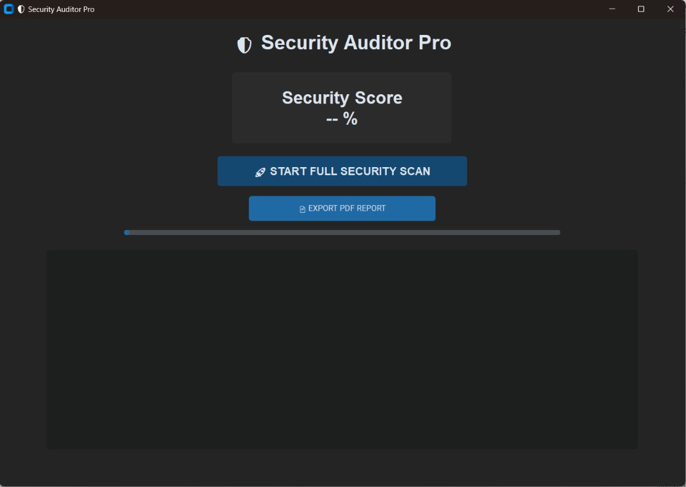
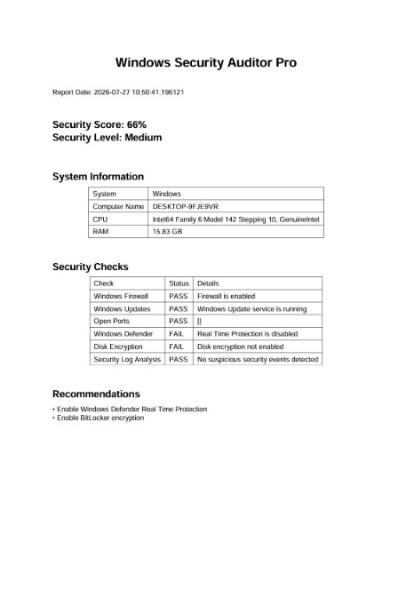

# Windows Security Auditor Pro

أداة مبنية بلغة Python لفحص وتقييم إعدادات أمان نظام Windows واكتشاف المخاطر الأمنية.

**A Python-based tool for auditing Windows security configurations, detecting security risks, and evaluating the overall protection level.**

## Interface GUI



## المشكلة | Problem

قد تكون بعض إعدادات الحماية في Windows غير مفعلة أو غير مضبوطة بالشكل الصحيح، مما قد يزيد من المخاطر الأمنية.

Some Windows security configurations may be disabled or improperly configured, increasing potential security risks.

## الحل | Solution

يقوم البرنامج بفحص مكونات أمان Windows وتحليل النتائج، ثم يحسب **Security Score من 100** مع إمكانية إنشاء تقرير أمني.

The tool scans and analyzes key Windows security components, calculates a **Security Score out of 100**, and generates a security report.

## أهم المميزات | Features

- فحص Windows Firewall
- فحص Windows Defender
- فحص حالة التشفير
- تحليل Windows Event Logs
- اكتشاف مؤشرات التهديدات
- حساب Security Score من 100
- إنشاء تقارير أمنية
- تخزين النتائج باستخدام SQLite
- واجهة رسومية سهلة الاستخدام

## نظام التقييم | Security Score

| المكون | Component | النسبة |
|---|---|---:|
| Firewall | جدار الحماية | 20% |
| Windows Defender | الحماية من التهديدات | 20% |
| Encryption | التشفير | 15% |
| Event Logs | سجلات الأحداث | 25% |
| Threat Detection | اكتشاف التهديدات | 20% |

**الدرجة النهائية | Final Score: 100/100**

## التقرير الأمني | Security Report



## المتطلبات | Requirements

- Windows 10 أو Windows 11
- Python 3.11 أو أحدث
- صلاحيات Administrator
- المكتبات الموجودة في `requirements.txt`

## المكتبات المستخدمة | Technologies

- Python
- CustomTkinter
- PyWin32
- psutil
- SQLite
- ReportLab

## طريقة التشغيل | Installation & Run

### 1. تحميل المشروع | Clone

```bash
git clone https://github.com/abdullah-cyb/Windows-Security-Auditor-Pro.git
```

### 2. الدخول إلى المشروع | Enter the project

```bash
cd Windows-Security-Auditor-Pro
```

### 3. تثبيت المتطلبات | Install dependencies

```bash
pip install -r requirements.txt
```

### 4. تشغيل البرنامج | Run

يفضل تشغيل CMD أو Terminal بصلاحيات **Administrator**.

Run CMD or Terminal as **Administrator**, then:

```bash
python main.py
```

## الاستخدام | Usage

يقوم البرنامج بفحص إعدادات أمان Windows وعرض النتائج ودرجة الأمان، مع إمكانية إنشاء تقرير بنتائج الفحص.

The application scans Windows security configurations, displays the results and security score, and allows the user to generate a security report.

## الهدف | Purpose

تم تطوير المشروع لأغراض **تعليمية ودفاعية** لمساعدة الطلاب والمهتمين بالأمن السيبراني على فهم وفحص إعدادات أمان Windows.

Developed for **educational and defensive security purposes** to help students and cybersecurity enthusiasts understand and audit Windows security configurations.

## Disclaimer

هذا المشروع مخصص للتدقيق الأمني والتعليم وتحسين الحماية، وليس للاستخدام في أي نشاط ضار أو غير مصرح به.

This project is intended for security auditing, education, and defensive purposes only. Do not use it for malicious or unauthorized activities.

## المطور | Developer

**Abdullah Cyber**

Cybersecurity Student & Developer
